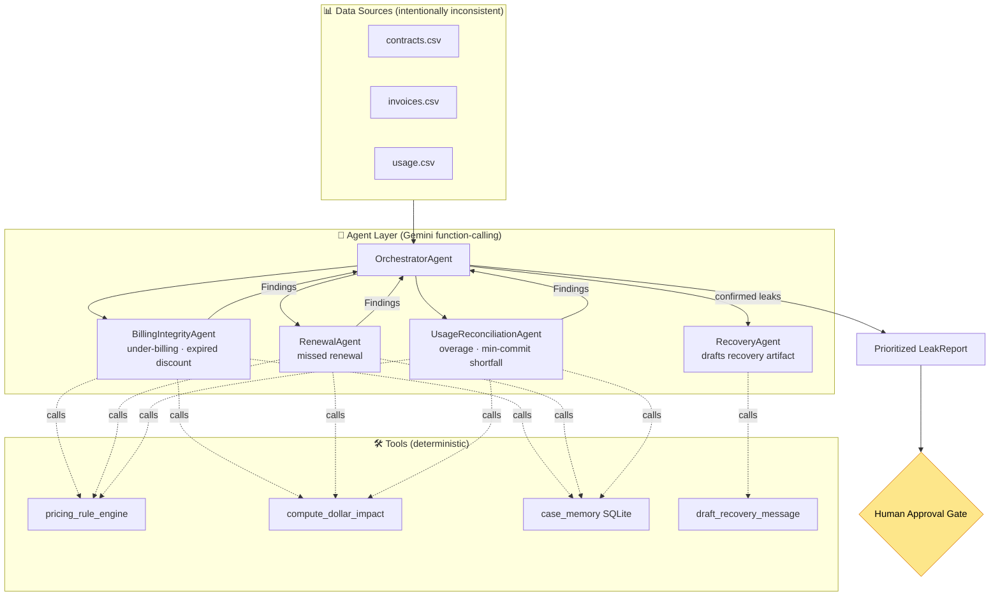

<div align="center">

# 🛡️ LeakSentry

### Autonomous Revenue Leakage Hunter

*A multi-agent system that reconciles **contracts**, **invoices**, and **usage** data — three sources that disagree in the real world — to autonomously find money a company is silently losing, quantify the dollar impact, and draft the recovery action behind a human-approval gate.*

<!-- Badges -->
[](LICENSE)
[](https://www.python.org/)
[](https://ai.google.dev/)
[](https://fastapi.tiangolo.com/)
[](https://nextjs.org/)
[](https://tailwindcss.com/)
[](https://docs.pytest.org/)
[](https://www.kaggle.com/)
[](https://github.com/MaharMuavia/LeakSentry/pulls)

[Problem](#-the-problem) · [Solution](#-the-solution) · [Architecture](#-architecture) · [Course Concepts](#-course-concepts-demonstrated) · [Eval Results](#-eval-results) · [Quickstart](#-quickstart)

</div>

---

## 💸 The Problem

> **TODO (cited source):** Companies lose an estimated **1–5% of annual revenue** to
> revenue leakage — under-billing, expired discounts still being honored, missed
> renewals, and unenforced contract terms. *(Citation to be inserted — source provided by author.)*

Revenue leakage is invisible by design: it hides in the gaps between systems that
were never meant to agree. The **contract** says one price, the **invoice** bills
another, and the **usage** data shows the customer consumed more than they paid for.
No single team owns all three sources, so the money quietly walks out the door.

## ✅ The Solution

LeakSentry is an **autonomous, multi-agent auditor**. It:

1. **Reconciles** three intentionally-inconsistent data sources (contracts, invoices, usage).
2. **Detects** candidate discrepancies with exact, deterministic pandas math.
3. **Judges** each candidate with Google Gemini — *is this a real leak, or explainable noise?*
4. **Quantifies** the dollar impact with deterministic code (never the LLM — that's a guardrail).
5. **Drafts** the recovery artifact (billing correction, renewal email, overage note) behind a **human-approval gate**. Nothing is ever sent.

### 🔑 The key design idea

> **Deterministic detection + LLM judgment.** Cheap, exact pandas analysis finds
> candidate discrepancies; Gemini is used *only where judgment lives* — separating
> real leaks from legitimate noise. Every dollar figure is traceable to deterministic
> code, never hallucinated by the model.

## 🏗️ Architecture



*(Detailed component breakdown in [ARCHITECTURE.md](ARCHITECTURE.md).)*

## 🎓 Course Concepts Demonstrated

This capstone demonstrates **four** course concepts, mapped to exact files:

| # | Concept | Where it lives |
|---|---------|----------------|
| 1 | **Tools & API integration** — agents call real tools | `tools/` *(pricing engine, dollar-impact calc, data loaders, draft generator)* |
| 2 | **Multi-agent / agent-to-agent** — orchestrator delegates to specialists passing structured Pydantic findings | `agents/` *(Orchestrator + 4 sub-agents)* |
| 3 | **Context engineering (memory + skills)** — persistent case memory so resolved leaks aren't re-flagged | `tools/case_memory.py`, reconciliation & recovery "skills" |
| 4 | **Quality, guardrails & evals** — confidence scoring, anti-hallucination guardrails, precision/recall eval harness | `agents/guardrails.py`, `eval/run_eval.py` |

## 📈 Eval Results

> **TODO:** Populated by `eval/run_eval.py` in build step 8.

| Metric | Deterministic-only | + Gemini judgment |
|--------|-------------------:|------------------:|
| Precision | _TBD_ | _TBD_ |
| Recall | _TBD_ | _TBD_ |
| F1 | _TBD_ | _TBD_ |
| Dollar-recall (% of true leak $) | _TBD_ | _TBD_ |
| False-positive rate (noise wrongly flagged) | _TBD_ | _TBD_ |

## 🚀 Quickstart

> **TODO:** Finalized in build step 9 (`make demo` + docker-compose). Target: a judge
> runs the full demo in **under 5 minutes**.

```bash
# 1. Clone + configure
git clone https://github.com/MaharMuavia/LeakSentry.git
cd LeakSentry
cp .env.example .env          # add your GEMINI_API_KEY

# 2. Install + seed synthetic data
pip install -r requirements.txt
python data/generate_dataset.py

# 3. Run the demo (backend + dashboard)
make demo                     # → http://localhost:3000
```

## 🗺️ Build Status

LeakSentry is built in small, verifiable steps:

- [x] **1. Scaffold** — repo structure, README, LICENSE, `.env.example`
- [ ] **2. Synthetic dataset** + labeled ground truth
- [ ] **3. Tools + deterministic detectors** (prove the math finds injected leaks)
- [ ] **4. Gemini integration** — LLM judgment + Orchestrator
- [ ] **5. Case memory + guardrails + RecoveryAgent**
- [ ] **6. FastAPI endpoints + JSONL tracing**
- [ ] **7. Next.js dashboard**
- [ ] **8. Eval harness** + results table
- [ ] **9. docker-compose + `make demo` + DEMO_SCRIPT**

## 📄 License

[MIT](LICENSE) © 2026 MaharMuavia — built for the Kaggle *AI Agents: Intensive Vibe Coding Capstone* (Agents for Business track).
